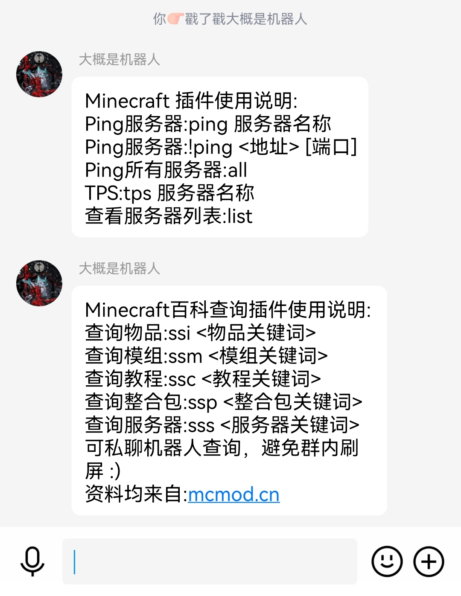
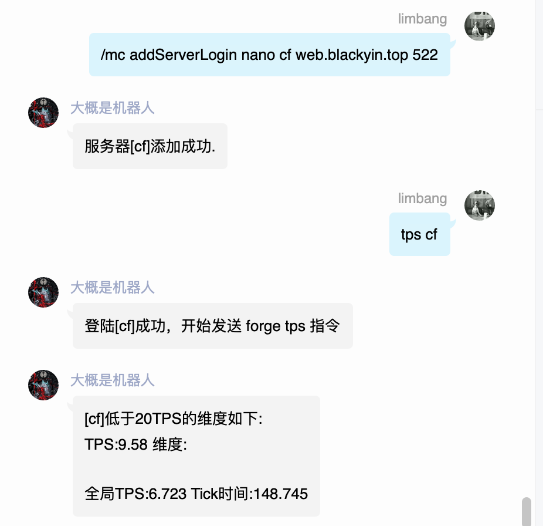
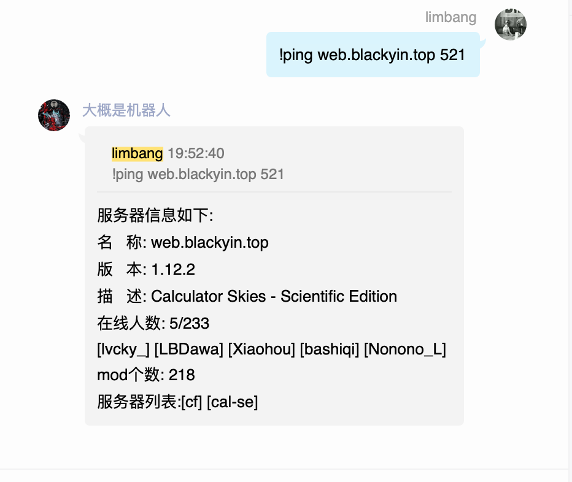
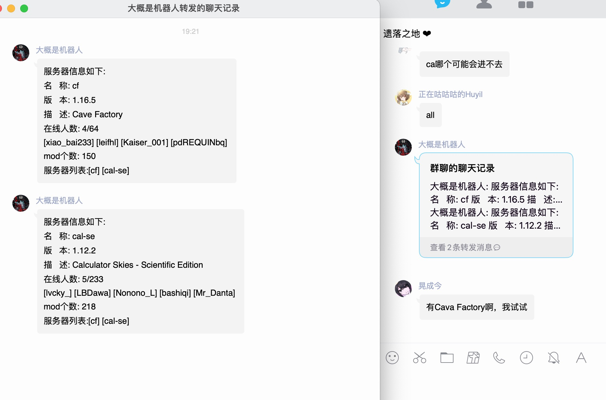

<div align="center">

[](https://github.com/limbang/mirai-console-minecraft-plugin/releases)

[](https://github.com/limbang/mirai-console-minecraft-plugin/blob/master/LICENSE)
[](https://github.com/mamoe/mirai)

本项目是基于 Mirai Console 编写的插件
<p>用于 ping 服务器状态,和查看服务器 tps,基于<a href = "https://github.com/Forsaken-Land/doctor">doctor</a>库实现</p>
<p>戳一戳机器人头像可以获取帮助</p>
</div>

## 命令

```shell
/mc addLogin <name> <authServerUrl> <sessionServerUrl> <username> <password>    # 添加登陆信息
/mc addServer <name> <address> [port]    # 添加服务器,端口默认 25565
/mc addServerLogin <loginName> <name> <address> [port]    # 添加带登陆信息带服务器,端口默认 25565
/mc deleteLogin <name>    # 删除登陆信息
/mc deleteServer <name>    # 删除服务器
/mc loginInfo    # 查看登陆信息
```
### 使用TPS功能
1. 使用指令添加登陆信息,比如添加遗落之地的皮肤站演示如下
```shell
/mc addLogin nano https://skin.blackyin.xyz/api/yggdrasil/authserver https://skin.blackyin.xyz/api/yggdrasil/sessionserver 账号 密码 
```
2. 然后添加服务器的时候用,`addServerLogin`命令添加,loginName 就是刚才设置的 nano,就可以使用了

mc addLogin url参考 [yggdrasil](https://github.com/yushijinhun/authlib-injector/wiki/Yggdrasil-%E6%9C%8D%E5%8A%A1%E7%AB%AF%E6%8A%80%E6%9C%AF%E8%A7%84%E8%8C%83#%E4%BC%9A%E8%AF%9D%E9%83%A8%E5%88%86)

- name   登陆配置名称
- authServerUrl 验证服务器地址 正版地址为:https://authserver.mojang.com
- sessionServerUrl 会话服务器地址 正版地址为:https://sessionserver.mojang.com
- username 账号
- password 密码

```shell
# 设置触发指令
/mc setCommand <name> <command>  
```
name 可设置如下
 - PING `ping服务器`
 - LIST `查询列表`
 - TPS `查询tps`
 - PING_ALL `ping全部服务器`


## 版本支持

TPS 暂时只支持 Forge 端

----

## 功能展示

戳一戳功能：


tps 功能：


直 ping 地址功能：


ping 全部添加的服务器功能：
