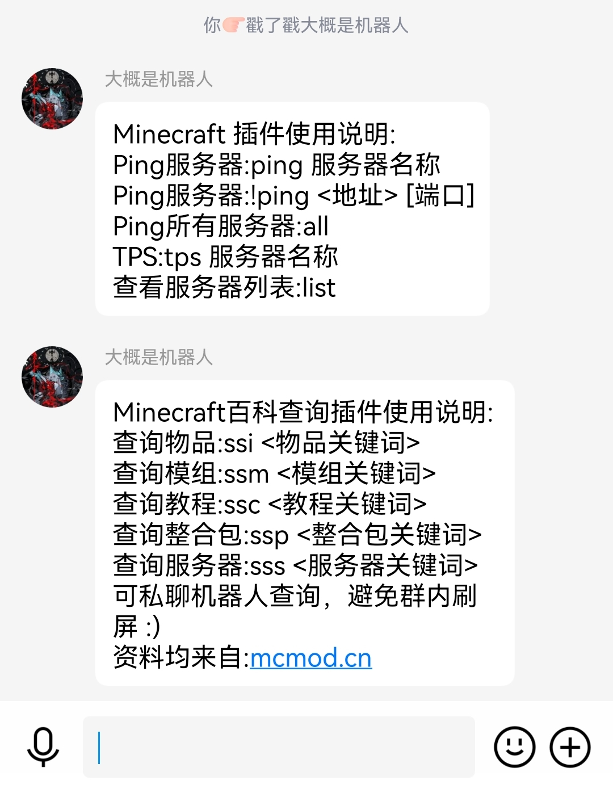
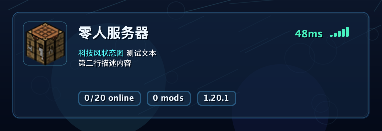
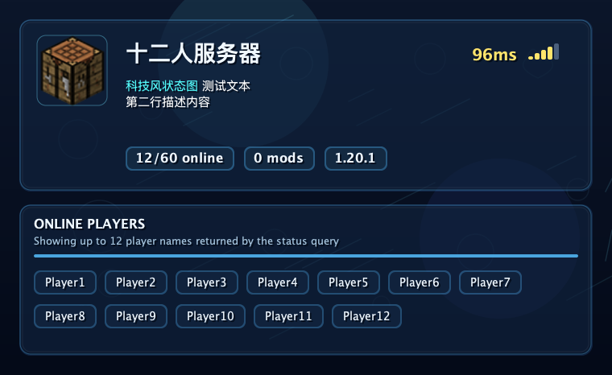
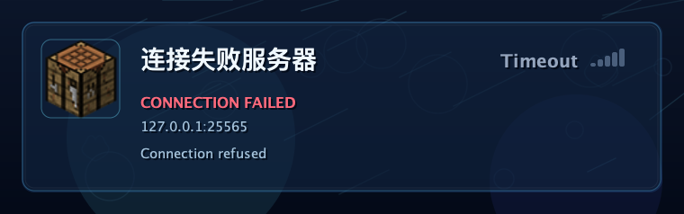
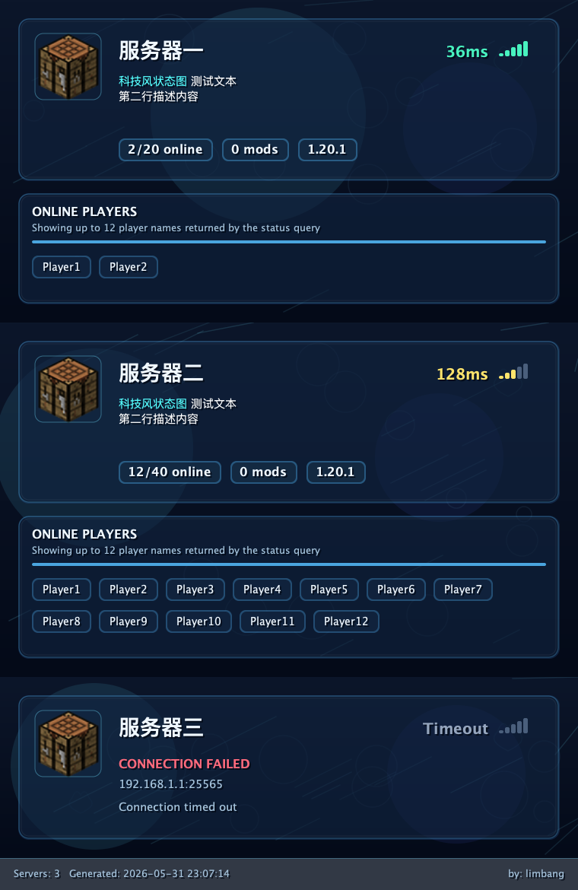

<div align="center">

[](https://github.com/limbang/mirai-console-minecraft-plugin/releases)

[](https://github.com/limbang/mirai-console-minecraft-plugin/blob/master/LICENSE)
[](https://github.com/mamoe/mirai)

本项目是基于 Mirai Console 编写的插件
<p>用于 ping 服务器状态</p>
<p>戳一戳机器人头像可以获取帮助</p>
</div>

可选前置插件[mirai-plugin-general-interface](https://github.com/limbang/mirai-plugin-general-interface)用来支持事件

## 功能

- 支持通过服务器名称或直接地址 `ping` Minecraft 服务器
- 支持把单服 `ping` 结果渲染成状态图片
- 支持把全部服务器状态拼接成一张总览图片
- 支持连接失败时返回失败状态图，而不是只返回异常文本
- 支持戳一戳机器人获取帮助
- 可选接入 `mirai-plugin-general-interface` 同步服务器改名事件

## 管理命令

```shell
/mc addServer <name> <address> [port]    # 添加服务器，端口默认 25565
/mc deleteServer <name>                  # 删除服务器
/mc rename <name> <newName>              # 重命名服务器
/mc setAllToImg <value>                  # 设置 ping 全部服务器时是否发送总览图片
/mc setPingToImg <value>                 # 设置单服 ping 时是否发送状态图片
/mc setNudgeHelp <value>                 # 设置是否开启戳一戳帮助
```

```shell
# 设置触发指令
/mc setCommand <name> <command>  
```
name 可设置如下
 - PING `ping服务器`
 - LIST `查询列表`
 - PING_ALL `ping全部服务器`

## 群内使用方式

下面的触发词由 `setCommand` 配置决定，以下只展示默认语义：

```shell
<PING命令> <serverName>      # 按已配置的服务器名称 ping
!ping <address> [port]       # 直接 ping 地址，端口默认 25565
<PING_ALL命令>               # ping 所有已配置服务器
<LIST命令>                   # 查看服务器列表
```

## 图片模式说明

- `isPingToImg = false`
  - 单服 `ping` 返回文本消息
- `isPingToImg = true`
  - 单服 `ping` 返回状态图片
  - 连接失败时会返回失败状态图

- `isAllToImg = false`
  - `ping all` 返回文本汇总
- `isAllToImg = true`
  - `ping all` 返回多张服务器状态卡拼接后的总览图片

## 配置项

- `serverMap`
  - 已配置服务器列表，键为显示名称，值为地址和端口
- `commandMap`
  - 群消息触发命令映射
- `isAllToImg`
  - 是否把 `ping all` 结果发送为总览图片，默认 `true`
- `isPingToImg`
  - 是否把单服 `ping` 结果发送为状态图片，默认 `false`
- `isNudgeHelp`
  - 是否开启戳一戳帮助功能，默认 `true`

## 功能展示

戳一戳功能：


单服状态图：


多玩家列表状态图：


连接失败状态图：


ping 全部添加的服务器总览图：

